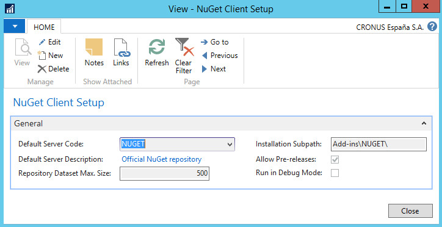
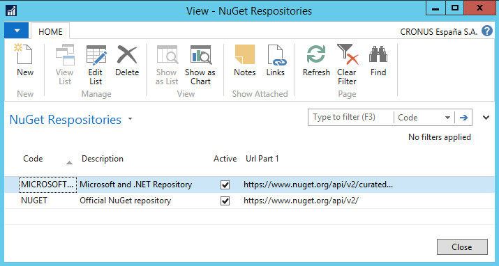
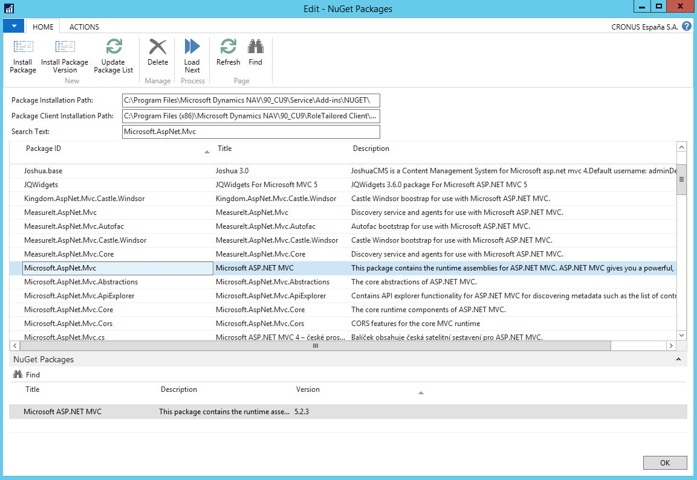
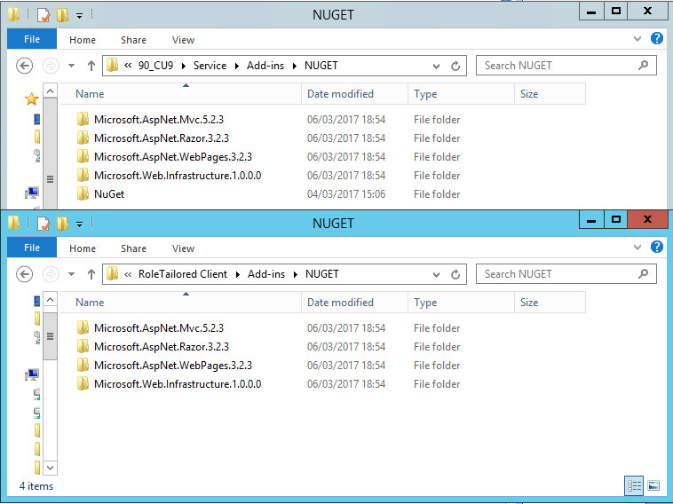

# NuGet client for MS Dynamics NAV
This repo contains NuGet client for MS Dynamics NAV. 
Right now the packages can be installed on both, on the server and client side.
The idea is to have your own NuGet server (easy to do) and be able to deploy your .NET developments there into the repository and then download them from NAV and leave them in the *add-ins* folder.

# Disclaimer
There are some issues related with the paging (partial loading of the next buckets).

# Getting started
* Renumber NAV objects to fit your requirements.

* Import objects.

* Run the initialization process - REPORT: **NuGet Setup Init.**

* All required libraries will be deployed automatically during the previous step. NAV setups will be created as well.

* You can configure the setups. There are just two tables (pages) to configure:

    * PAGE **NuGet Client Setup**
      
    This is the main module setup. You need to select: 

        * *Default server (repository) code* - this table points to **NuGet Repository** table and you specify the default one. You have to specify one of them. This is very useful especially in case you are using your own private repository and prefer use just this one as a default one.

        * *Installation Subpath* - Specify the subpath where all packages and their dependencies will be deployed to. This subpath should start with *Add-ins* and then you can specify whatever you want.

    * PAGE **NuGet Repositories**
      
    You specify NuGet repositories right here. As usually, put a code and a description, a path (repository feed URL) and you can also say if a repository will be active or inactive (this could be useful especially when working with multiple repositories).

* Open PAGE: **NuGet Packages**
  
This is the main PAGE from the user perspective. In this PAGE you can list, search and install NuGet packages. As you can see, you can install the latest package version or you can install a specific one.

* Select a package + press button **Install** (or select a specific package and version + **Install package version**)
  
You can see the package *Microsoft.Asp.Mvc* deployed on both parts - server and client folder. You can also see that all dependencies have been deployed as well.

# To-do
* Package lists (deploy automatically all packages from the list and their dependencies).